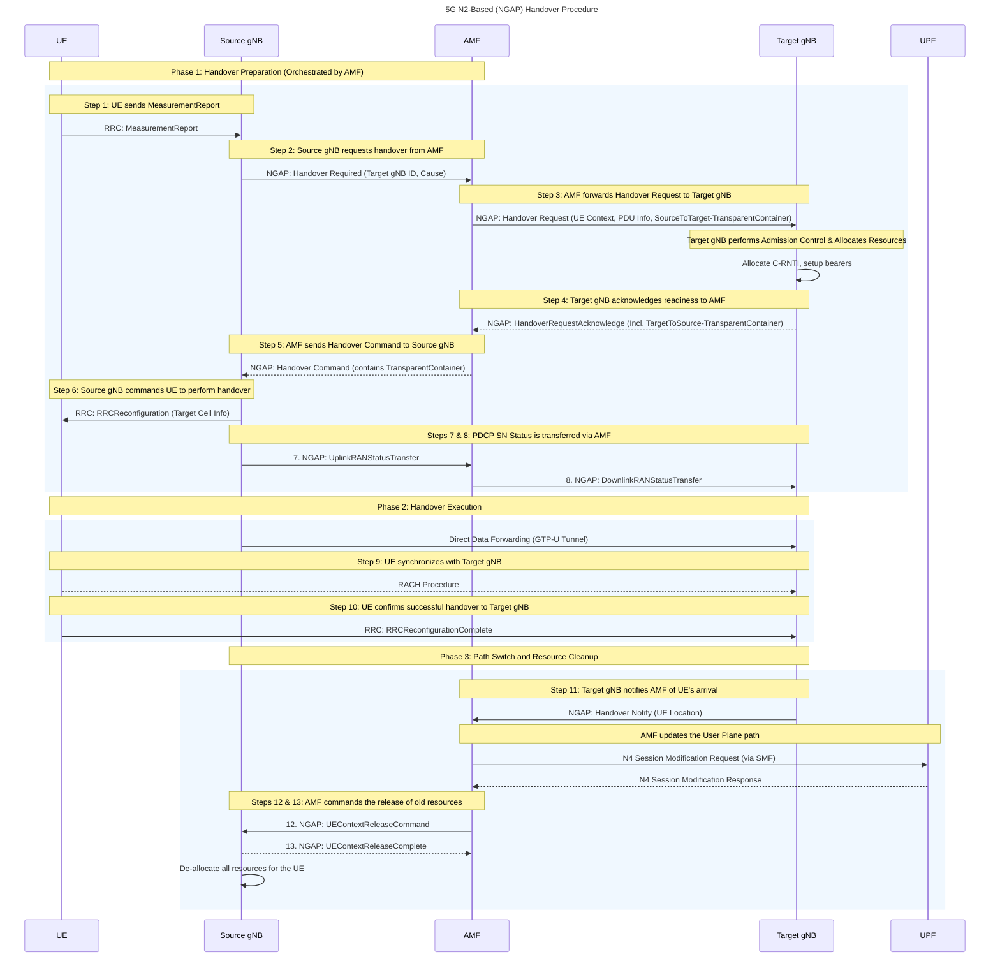

***

### **5G N2-based (NGAP) Inter-gNB Handover (Detailed Study Notes)**

This document provides a comprehensive overview of the N2-based (also known as NGAP-based) handover procedure in 5G networks. This procedure is used when a direct Xn interface between gNBs is unavailable or not permitted by network policy.

#### **1. Core Concepts & Key Points**

###### **What is an N2 Handover?**
An N2 handover is a procedure where the handover signaling between the source and target gNBs is relayed through the **AMF (Access and Mobility Management Function)** in the 5G Core. Instead of communicating directly, the gNBs use the N2 interface (which connects them to the AMF) to coordinate the handover.

###### **Key Technical Points for N2 Handover**
*   **Analogy:** The N2 handover is the 5G equivalent of the **S1 handover in 4G LTE**.
*   **No Xn Dependency:** This procedure is essential when no Xn interface exists between two gNBs. It can also be used as a fallback or if network policy restricts the use of Xn.
*   **AMF's Role:** The AMF acts as a central orchestrator or "middleman," relaying messages between the two gNBs.
*   **Mobility Scope:** Unlike Xn, this handover can support both **intra-AMF** (gNBs connected to the same AMF) and **inter-AMF** (gNBs connected to different AMFs) mobility.
*   **Latency:** The N2 handover is generally slower than an Xn handover because the signaling path is longer and involves more core network processing.
*   **Data Forwarding:** It supports both **direct** (gNB-to-gNB) and **indirect** (through the UPF) data forwarding to minimize packet loss.
*   **Re-Registration** is required after Successful Handover if the **Source gNB** and **Target gNB** belong to different **Tracking Area** (TAC)

###### **N2 Handover Procedure**
![[Pasted image 20250729122415.png]]

Above picture depicts the mobility scenarios where UEs is connected to **cource cell** with PCI: 22 with **gNB#1** and it is moving toward target cell#2 with PCI:21 with **gNB#2**. In this handover procedure the **signaling** will involve messaging over N2 interface using using **NGAP protocol**.

---

#### **2. The Role of the AMF as Orchestrator**

In an N2 handover, the AMF is the central point of control. All handover preparation messages that would have been exchanged directly over the Xn interface are now sent via the AMF.

*   The source gNB sends a request *to the AMF*.
*   The AMF forwards this request *to the target gNB*.
*   The target gNB responds *to the AMF*.
*   The AMF forwards the response back *to the source gNB*.

This orchestration makes the process more robust and flexible, especially in multi-vendor networks where Xn links may not be established, but it adds latency compared to the direct Xn path.

---


---
#### **3. Step-by-Step N2-based Handover Procedure (Detailed)**

##### **Phase 1: Preparation Phase**

###### **Step 0: UE is in RRC_Connected State**
- UE is in **RRC_CONNECTED**, sending and receiving uplink and downlink data at the source gNB and moving toward the Target gNB
###### **Step 1: Measurement Reporting**
- **Action:** The UE is in `RRC_CONNECTED` state and informs the network about its radio conditions.
- **Message:** `RRC: MeasurementReport`
- **From -> To:** UE -> Source gNB
- **Technical Detail:** The source gNB pre-configures the UE with a `measConfig` element (via an earlier `RRCReconfiguration`), defining what to measure and when to report. A common trigger is **Event A3**, where a neighbor cell's signal becomes stronger than the serving cell's by a specific offset.
- **Example Message Content:**
```
MeasurementReport {
  measResults {
    servingCell { rsrp: -95dBm, rsrq: -12dB, sinr },
    neighbourCells {
      pci: 101, rsrp: -85dBm, rsrq: -9dB, sinr
      pci: 102, rsrp: -98dBm, rsrq: -14dB, sinr
    }
  }
}
```
- ![[Pasted image 20250729123817.png]]
- **Purpose:** This report provides the source gNB with data to make an informed handover decision.

###### **Step 2: Handover Required**
*   **Action:** The source gNB decides to initiate a handover and informs the AMF.
*   **Message:** `NGAP: Handover Required`
*   **From -> To:** Source gNB -> AMF
*   **Example Message Content:** 
```
Handover Required { 
	ran-ue-ngap-id, 
	amf-ue-ngap-id, 
	targetGnbId, 
	handoverType: "NR to NR", 
	cause, 
	pduSessionList 
}
```
-   ![[Pasted image 20250729123732.png]]
*   **Purpose:** Since there is no direct Xn link, the source gNB asks the AMF to orchestrate the handover with the specified target gNB.

###### **Step 3: Handover Request**
*   **Action:** The AMF relays the handover request to the target gNB.
*   **Message:** `NGAP: Handover Request`
*   **From -> To:** AMF -> Target gNB
*   **Technical Detail:** The AMF forwards the UE's context, including security info, capabilities, and a `SourceToTarget-TransparentContainer` which holds information from the source gNB that the target gNB will need.
* ![[Pasted image 20250729123850.png]]
*   **Purpose:** To formally instruct the target gNB to prepare for the incoming UE.

###### **Step 4: Handover Request Acknowledge**
*   **Action:** The target gNB performs admission control and responds to the AMF.
*   **Message:** `NGAP: HandoverRequestAcknowledge`
*   **From -> To:** Target gNB -> AMF
*   **Technical Detail:** If resources are available, the target gNB prepares a `TargetToSource-TransparentContainer` with the RRC configuration for the UE and sends it back to the AMF.
*   **Example Message Content:** `HandoverRequestAcknowledge { admittedPduSessionList, TargetToSource-TransparentContainer }`
* ![[Pasted image 20250729123930.png]]
*   **Purpose:** To confirm to the AMF that it is ready to accept the UE and to provide the necessary radio configuration for the UE to connect.

###### **Step 5: Handover Command**
*   **Action:** The AMF forwards the confirmation and radio configuration to the source gNB.
*   **Message:** `NGAP: Handover Command`
*   **From -> To:** AMF -> Source gNB
* ![[Pasted image 20250729123958.png]]
*   **Purpose:** To give the source gNB the final go-ahead and the necessary RRC configuration (inside the transparent container) to command the UE to perform the handover.

###### **Step 6: RRC Reconfiguration (Handover Command)**
*   **Action:** The source gNB sends the final handover command to the UE.
*   **Message:** `RRC: RRCReconfiguration`
*   **From -> To:** Source gNB -> UE
*   **Technical Detail:** The source gNB triggers the handover by sending the **RRCReconfiguration** message to the UE, containing the information required to access the **target cell**. This message includes the `mobilityControlInfo` IE, which contains the new C-RNTI, target cell security algorithms, and optionally, dedicated RACH preambles for a faster, contention-free access.
- **Example Message Content:**
```
RRCReconfiguration {
  mobilityControlInfo {
    targetPhysCellId: 101,
    newUE-Identity: 55, // The new C-RNTI
    rach-ConfigDedicated { ... } // For faster, contention-free access
  }
}
```
*   **Purpose:** This is the official instruction for the UE to detach from the source cell and synchronize with the target cell using the provided parameters.

###### **Step 7 & 8: RAN Status Transfer (via AMF)**
*   **Action:** The PDCP sequence number status is transferred via the AMF to ensure a lossless handover.
*   **Messages:**
    1.  `NGAP: UplinkRANStatusTransfer` (Source gNB -> AMF)
    2.  `NGAP: DownlinkRANStatusTransfer` (AMF -> Target gNB)
*   **Technical Detail:** Unlike the direct Xn transfer, this information is now relayed through the AMF. The transparent container carries the PDCP SN status for all active data radio bearers.
* ![[Pasted image 20250729124414.png]]
* ![[Pasted image 20250729124435.png]]
*   **Purpose:** To prevent data loss or duplication by ensuring the target gNB knows exactly where to resume the data flow.

---
##### **Phase 2: Execution Phase**

###### **Step 9 & 10: UE Connects and Confirms**
*   **Action:** The UE performs a Random Access (RACH) procedure on the target cell and confirms the handover is complete from its side.
*   **Message:** `RRC: RRCReconfigurationComplete`
*   **From -> To:** UE -> Target gNB
*   **Purpose:** To signal to the target gNB that the radio link is successfully established. UE starts Uplink data to Target gNB.

---
##### **Phase 3: Completion Phase**

###### **Step 11: Handover Notify**
*   **Action:** The target gNB informs the AMF that the UE has successfully arrived.
*   **Message:** `NGAP: Handover Notify`
*   **From -> To:** Target gNB -> AMF
*   **Technical Detail:** This message is the trigger for the AMF to initiate the user plane path switch by instructing the SMF/UPF. And also UE location information mean under which **Tracking Area** (TAC) UE is being served.
* ![[Pasted image 20250729124610.png]]
*   **Purpose:** To confirm the handover's success to the core network and to initiate the switch of the downlink data path to the target gNB.

###### **Step 12 & 13: UE Context Release**
*   **Action:** The AMF commands the source gNB to release the UE's resources.
*   **Messages:**
    1.  `NGAP: UEContextReleaseCommand` (AMF -> Source gNB)
    2.  `NGAP: UEContextReleaseComplete` (Source gNB -> AMF)
-  ![[Pasted image 20250729124722.png]]
- ![[Pasted image 20250729124740.png]]
*   **Purpose:** This is the final cleanup step. The AMF instructs the source gNB to delete the UE's context and free up all associated resources, ensuring network efficiency.

---
#### **4. Benefits and Implications**

| Implication Category     | Benefit / Implication                                                                                                                                                                                                                                                                                                                      |
| :----------------------- | :--------------------------------------------------------------------------------------------------------------------------------------------------------------------------------------------------------------------------------------------------------------------------------------------------------------------------- |
| **Network Implications** | **High Flexibility:** Works without a direct Xn link, making it ideal for multi-vendor networks or as a fallback. <br> **Increased Core Network Load:** Involves the AMF in signaling, which increases processing load and signaling traffic in the core network compared to Xn handovers. |
| **User Implications**    | **Higher Latency:** The longer signaling path through the AMF results in a slightly longer service interruption time compared to an Xn handover. <br> **Seamless Experience:** Despite being slower, the handover is still designed to be seamless, and for most applications, the difference is not noticeable to the user. |