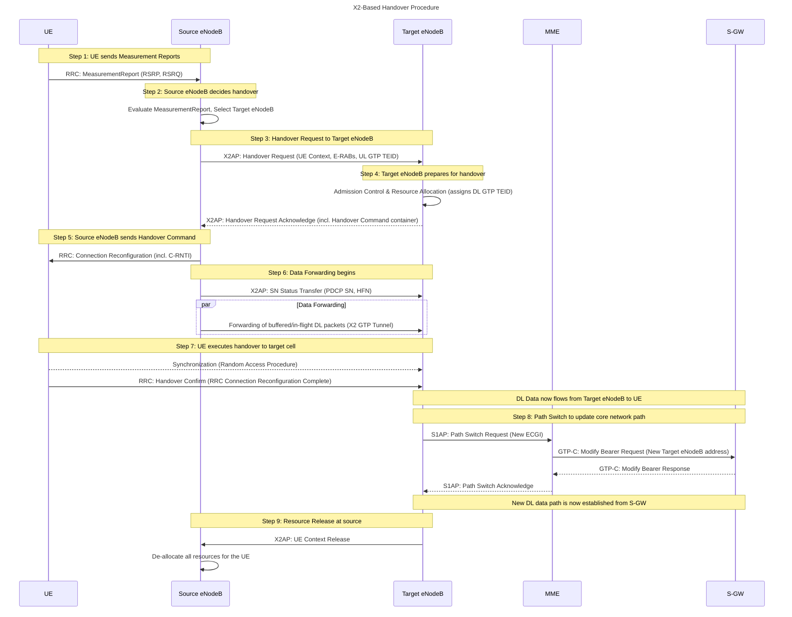
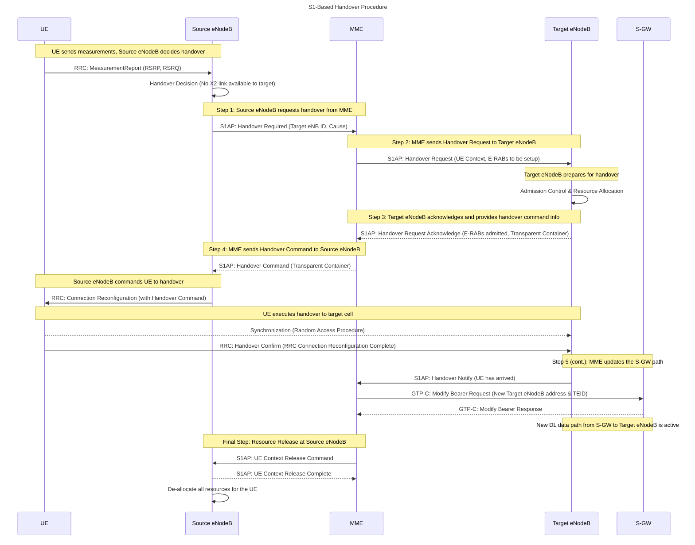
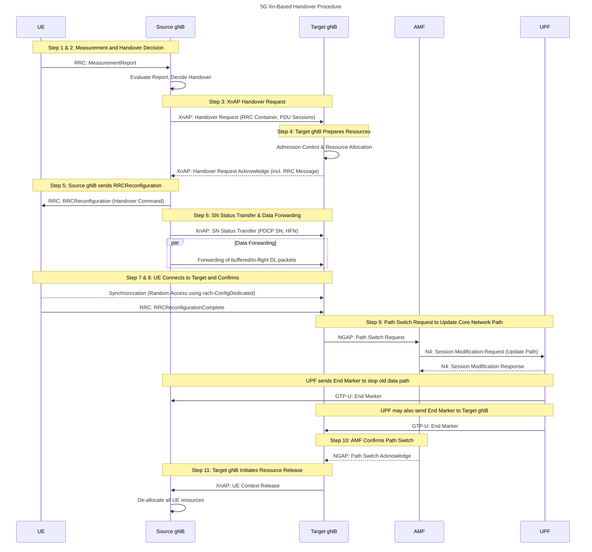
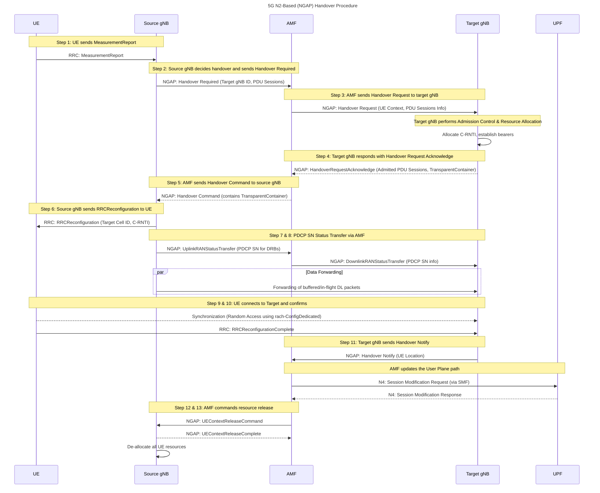
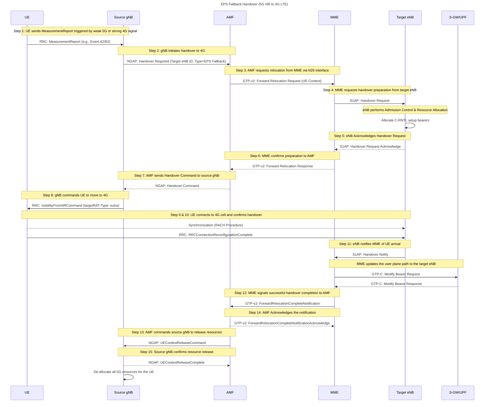
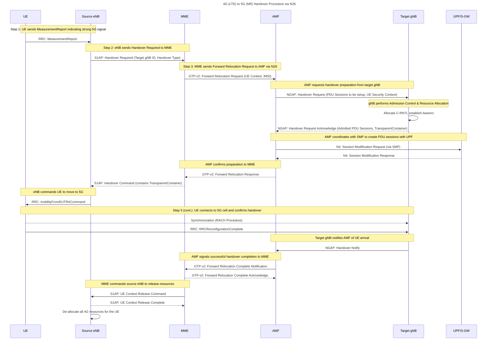

## Introduction

Handover, also known as handoff, is a critical process in mobile telecommunications that ensures a User Equipment (UE) maintains seamless connectivity as it moves between different cells or network types. This process is essential for uninterrupted voice calls, data sessions, and other services in both 4G Long-Term Evolution (LTE) and 5G New Radio (NR) networks. This study provides a comprehensive analysis of handover mechanisms in 4G and 5G, detailing their procedures, types, and advancements, with a focus on intra-system and inter-Radio Access Technology (RAT) handovers, including the EPS Fallback mechanism.

## Handover Fundamentals

==Handover involves transferring an active connection from a source base station to a target base station while the UE is in the Radio Resource Control (RRC) Connected state.== This differs from cell reselection, which occurs in RRC Idle or Inactive states, and redirection, where the UE moves to idle mode in the target cell. Handovers are triggered by factors such as deteriorating signal quality, stronger signals from neighboring cells, load balancing, or service requirements (e.g., voice calls requiring a fallback to 4G).

### Key Triggers for Handover

- ==**Radio Conditions**: Events like A3 (neighbor cell signal stronger than serving cell by a threshold for a Time-to-Trigger duration) initiate handovers.==
- ==**Load Balancing**: High network load may prompt a handover to a less congested cell.==
- ==**Service Requirements**: For instance, voice calls in 5G may trigger an EPS Fallback to 4G if Voice over New Radio (VoNR) is unavailable.==

## 4G LTE Handover Mechanisms

In 4G LTE, handovers are managed within the Evolved Packet System (EPS), involving eNodeBs (base stations), the Mobility Management Entity (MME), and the Serving Gateway (S-GW). Handovers are categorized as intra-LTE (within 4G) or inter-RAT (to 3G/2G).

### Types of 4G Handovers

|**Type**|**Description**|
|---|---|
|**Intra-eNodeB**|Between sectors of the same eNodeB, requiring minimal signaling.|
|**Inter-eNodeB**|Between different eNodeBs, using X2 (direct) or S1 (core network) interfaces.|
|**Inter-MME**|When the UE moves to a different MME area, involving core network coordination.|
|**Inter-RAT**|Between LTE and 3G/2G, e.g., for voice calls using Circuit-Switched Fallback (CSFB).|

### [[X2-based Handover Procedure]]

The X2-based handover is preferred when a direct X2 interface exists between eNodeBs, minimizing core network involvement and reducing latency. The procedure is as follows:

| **Step** | **Action**                           | **Details**                                                                                          |
| -------- | ------------------------------------ | ---------------------------------------------------------------------------------------------------- |
| 1        | UE sends Measurement Reports         | Periodic RRC Measurement Reports include signal strength (RSRP, RSRQ) of serving and neighbor cells. |
| 2        | Source eNodeB decides handover       | Based on reports, selects target eNodeB with active X2 connection.                                   |
| 3        | Handover Request to target eNodeB    | Via X2, includes UE-AMBR, E-RABs, QoS parameters, and UL GTP TEID.                                   |
| 4        | Target eNodeB prepares               | Allocates resources, assigns DL GTP TEID, sends Handover Request Acknowledge.                        |
| 5        | Source eNodeB sends Handover Command | Via RRC Connection Reconfiguration, includes C-RNTI, DRB-ID.                                         |
| 6        | Data Forwarding                      | Source eNodeB sends SN Status Transfer (PDCP SN, HFN) to target eNodeB.                              |
| 7        | UE executes handover                 | Performs Random Access to target eNodeB, sends Handover Confirm.                                     |
| 8        | Path Switch                          | Target eNodeB sends Path Switch Request to MME, updates S-GW bearer path.                            |
| 9        | Resource Release                     | Target eNodeB sends UE Context Release to source eNodeB.                                             |

### S1-based Handover

When the X2 interface is unavailable (e.g., inter-vendor scenarios), the S1-based handover routes signaling through the MME:

1. Source eNodeB sends a Handover Required message to the MME.
2. MME sends a Handover Request to the target eNodeB.
3. Target eNodeB responds with a Handover Acknowledgment.
4. MME sends a Handover Command to the source eNodeB.
5. The UE completes the handover, and the MME updates the S-GW path.

This process involves more core network signaling, increasing latency compared to X2-based handovers.

## [[5G Handover Mechanisms]]

5G handovers are designed for the Next Generation Radio Access Network (NG-RAN) and 5G Core (5GC), using gNBs and interfaces like Xn (between gNBs) and N2 (between gNB and AMF). 5G supports intra-NR handovers and inter-RAT handovers, with enhancements like dual connectivity and network slicing.

### Types of 5G Handovers

|**Type**|**Description**|
|---|---|
|**Intra-gNB**|Within the same gNB, between different Distributed Units (DUs) under one Central Unit (CU).|
|**Xn-based Inter-gNB**|Between gNBs with an Xn interface, within NG-RAN.|
|**N2-based Inter-gNB**|Between gNBs without Xn, coordinated via AMF using N2 interface.|
|**Inter-System**|Between 5GS and EPS (4G core), via N26 interface.|
|**Inter-RAT**|Between NR and E-UTRA (LTE), staying on 5GC or switching to EPC.|
|**NSA/MR-DC**|In Non-Standalone (NSA) or Multi-RAT Dual Connectivity, involving master/secondary nodes.|
|**Non-3GPP Access**|To trusted/untrusted non-3GPP networks (e.g., Wi-Fi).|

### [[Xn-based Handover Procedure]]

The Xn-based handover in 5G is analogous to the X2-based handover in 4G, optimized for lower latency:

|**Step**|**Action**|**Details**|
|---|---|---|
|1|UE sends MeasurementReport|Includes serving and neighbor cell signal strength.|
|2|Source gNB decides handover|Based on reports, cell load, and UE capabilities, selects target gNB.|
|3|XnAP Handover Request to target gNB|Includes RRC container, target cell ID, PDU sessions.|
|4|Target gNB prepares|Allocates resources, sends XnAP Handover Acknowledge with RRC message.|
|5|Source gNB sends RRCReconfiguration|Contains Handover Command with target cell ID, C-RNTI, security settings.|
|6|SN Status Transfer|Source gNB sends PDCP SN, HFN, and buffers data for forwarding.|
|7|UE performs Random Access|Uses rach-ConfigDedicated to connect to target gNB.|
|8|UE sends RRCReconfigurationComplete|Completes handover, starts uplink data.|
|9|NGAP Path Switch Request to AMF|Updates PDU session paths, UPF sends End Marker to source and target gNB.|
|10|AMF sends Path Switch Acknowledge|Confirms path switch, lists switched/released PDU sessions.|
|11|Target gNB sends XnAP UE Context Release|Source gNB releases UE resources.|

### N2-based Handover

When Xn is unavailable, the N2-based (or NGAP-based) handover involves the AMF, similar to 4G's S1 handover. The steps are:

| **Step** | **Action**                                          | **Details**                                                          |
| -------- | --------------------------------------------------- | -------------------------------------------------------------------- |
| 1        | UE sends MeasurementReport                          | Includes serving and neighbor cell signal strength.                  |
| 2        | Source gNB decides handover                         | Sends N2 Handover Required to AMF with target gNB ID, PDU sessions.  |
| 3        | AMF sends Handover Request to target gNB            | Includes UE security context, capabilities, PDU session information. |
| 4        | Target gNB responds with HandoverRequestAcknowledge | Lists admitted PDU sessions, TargetToSource-TransparentContainer.    |
| 5        | AMF sends Handover Command to source gNB            | Triggers handover execution.                                         |
| 6        | Source gNB sends RRCReconfiguration                 | Includes target cell ID, C-RNTI, security algorithm identifiers.     |
| 7        | Source gNB sends UplinkRANStatusTransfer            | To AMF, includes PDCP SN for DRBs.                                   |
| 8        | AMF sends DownlinkRANStatusTransfer                 | To target gNB, forwards PDCP SN information.                         |
| 9        | UE performs Random Access                           | Using rach-ConfigDedicated on target gNB.                            |
| 10       | UE sends RRCReconfigurationComplete                 | Starts uplink data on target gNB.                                    |
| 11       | Target gNB sends Handover Notify                    | To AMF, includes UE location under TAC.                              |
| 12       | AMF sends UEContextReleaseCommand                   | To source gNB, indicating successful handover.                       |
| 13       | Source gNB sends UEContextReleaseComplete           | Releases UE context.                                                 |
|          |                                                     |                                                                      |

**Notes**:

- Supports direct or indirect data forwarding.
- Applicable for intra/inter-AMF mobility.
- Slower than Xn-based due to core network signaling [Techplayon, 2025](https://www.techplayon.com/5g-sa-inter-gnb-handover-n2-or-ngap-handover/).

## Inter-RAT Handovers (4G to 5G and Vice Versa)

Inter-RAT handovers between 4G and 5G are critical for ensuring service continuity, especially in areas with mixed coverage or when 5G lacks certain services (e.g., voice).

### EPS Fallback (5G to 4G)

EPS Fallback is an inter-RAT handover from 5G NR to 4G LTE when VoNR is unsupported, ensuring voice calls proceed via VoLTE. The procedure involves:

|**Step**|**Action**|**Details**|
|---|---|---|
|1|UE sends MeasurementReport|Triggered by A2/B2 events indicating 4G cell suitability.|
|2|gNB sends NGAP HandoverRequired|To AMF, includes target eNB ID, handover type.|
|3|AMF sends GTP-v2 Forward Relocation Request|To MME via N26 interface, transfers UE context.|
|4|MME sends S1AP HandoverRequest|To target eNB, sets up resources.|
|5|eNB sends S1AP HandoverRequestAcknowledge|Confirms resource allocation.|
|6|MME sends GTP-v2 Forward Relocation Response|To AMF, confirms setup.|
|7|AMF sends NGAP HandoverCommand|To gNB, triggers handover execution.|
|8|gNB sends mobilityFromNRCommand|To UE, includes targetRAT-Type (eutra), targetRAT Container.|
|9|UE performs RACH procedure|On target eNB, using rach-ConfigCommon or Dedicated.|
|10|UE sends RRCReconfigurationComplete|To eNB, completes handover.|
|11|eNB sends S1AP HandoverNotify|To MME, confirms UE connection.|
|12|MME sends GTP-v2 ForwardRelocationCompleteNotification|To AMF, signals completion.|
|13|AMF sends NGAP UEContextReleaseCommand|To gNB, releases 5G context.|
|14|MME sends GTP-v2 ForwardRelocationCompleteNotificationAcknowledge|To AMF, finalizes signaling.|
|15|gNB sends NGAP UEContextReleaseComplete|Confirms resource release.|

**Notes**:

- Introduces ~2-second call setup delay [3G4G Blog, 2020](https://blog.3g4g.co.uk/search/label/Handover).
- Triggered by B1/B2 events, depending on vendor implementation.
- Alternative: Release with Redirection, where 5G RRC Release instructs UE to reselect 4G [Techplayon, 2025](https://www.techplayon.com/5g-eps-fallback-5g-to-4g-handover/).

### 4G to 5G Handover

When a UE moves from 4G to 5G coverage, the process involves:

1. UE sends measurement reports indicating stronger 5G signals.
2. eNodeB sends a Handover Required message to the MME.
3. MME coordinates with the AMF via N26 to transfer context.
4. AMF sets up PDU sessions with the UPF and target gNB.
5. UE connects to the 5G gNB, resuming data services.

## Advancements in 5G Handovers

5G introduces several features that enhance handover performance compared to 4G:

- **Dual Connectivity (DC)**: In Non-Standalone (NSA) deployments, UEs can connect to both 4G eNodeB (master) and 5G gNB (secondary) via EN-DC (E-UTRA-NR Dual Connectivity). This reduces inter-RAT handovers by maintaining simultaneous connections, improving throughput and reliability.
- **Network Slicing**: 5G supports network slices tailored for specific services (e.g., low-latency gaming). Handovers consider slice availability in the target cell, ensuring service continuity.
- **RRC Inactive State**: Introduced in 5G, this state allows UEs to quickly resume connections without full RRC re-establishment, reducing handover latency.
- **Conditional Handover (CHO)**: The UE evaluates conditions post-handover command, executing the handover only if conditions are met, reducing ping-pong effects.
- **gNB Disaggregation**: gNBs are split into Radio Unit (RU), Distributed Unit (DU), and Central Unit (CU). Intra-gNB handovers (e.g., between DUs under one CU) require no core signaling, minimizing latency.

## Comparison of 4G and 5G Handovers

|**Aspect**|**4G LTE**|**5G NR**|
|---|---|---|
|**Base Station**|eNodeB|gNB|
|**Core Network**|EPC (MME, S-GW)|5GC (AMF, UPF)|
|**Interfaces**|X2 (inter-eNodeB), S1 (eNodeB-MME)|Xn (inter-gNB), N2 (gNB-AMF)|
|**Session Type**|Bearers (E-RABs)|PDU Sessions|
|**Handover Types**|Intra-eNodeB, Inter-eNodeB, Inter-MME, Inter-RAT|Intra-gNB, Xn/N2-based Inter-gNB, Inter-System, Inter-RAT, NSA/MR-DC|
|**New Features**|Limited to CSFB, SRVCC for voice|Dual Connectivity, Network Slicing, RRC Inactive, Conditional Handover|
|**Interruption Time**|~50-100 ms|~30-60 ms, shorter for intra-gNB or beam mobility|

## Challenges and Optimizations

- **4G Challenges**: Handovers to 3G/2G (e.g., for voice) can introduce delays, and X2 unavailability increases S1-based handover latency. Ping-pong handovers (rapid switching between cells) are mitigated by optimizing Time-to-Trigger (TTT) and Handover Margin (HOM).
- **5G Challenges**: Higher frequencies (e.g., mmWave) and smaller cell sizes increase handover frequency. Network slicing and dual connectivity add complexity, requiring robust admission control and slice-aware handovers.
- **Optimizations**: Research suggests using machine learning (e.g., Kriging Interpolator) to predict optimal handover targets, reducing unnecessary handovers by 5-7% ([ResearchGate, 2018](https://www.researchgate.net/publication/326009877)). Adaptive TTT and HOM settings, along with Conditional Handover, further enhance reliability.

## Conclusion

Handovers in 4G and 5G are essential for seamless mobile connectivity, with 5G introducing advanced features like dual connectivity, network slicing, and RRC Inactive state to improve performance. While 4G relies on X2/S1 interfaces and EPS, 5G leverages Xn/N2 interfaces and 5GC, offering lower latency and greater flexibility. Inter-RAT handovers, such as EPS Fallback, ensure compatibility between generations, though they may introduce slight delays. Ongoing research and optimizations continue to enhance handover efficiency, addressing challenges in dense and high-mobility environments.

## References

- [3GPP TS 36.300](https://www.3gpp.org/ftp/Specs/archive/36_series/36.300/) - E-UTRA Overall Description
- [3GPP TS 38.300](https://www.3gpp.org/ftp/Specs/archive/38_series/38.300/) - 5G NR Overall Description
- [Devopedia: 5G Handover](https://devopedia.org/5g-handover)
- [Techplayon: X2 Handover Call Flow in 4G LTE](https://www.techplayon.com/x2-handover-call-flow-in-4g-lte/)
- [Techplayon: 5G SA Inter gNB Handover - Xn Handover](https://www.techplayon.com/5g-sa-inter-gnb-hanodver-xn-handover/)
- [3G4G Blog: Challenges of 5G Inter-Node Handovers](https://blog.3g4g.co.uk/2019/12/challenges-of-5g-inter-node-handovers.html)
- [ResearchGate: Research on Handover Technologies in 5th Generation Wireless Communication System](https://www.researchgate.net/publication/326009877_Research_on_Handover_Technologies_in_5th_Generation_Wireless_Communication_System)