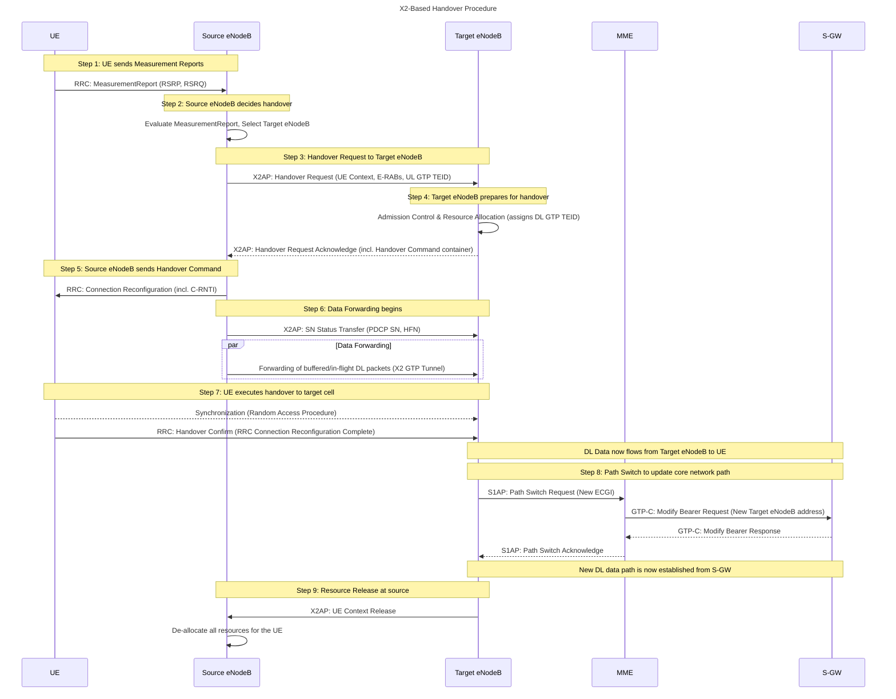

---
An in-depth examination of the X2-based handover procedure reveals a meticulously choreographed sequence of events designed to seamlessly transfer a user's connection between two eNodeBs (the base stations in an LTE network) with minimal interruption. This process is favored for its speed and efficiency, as it largely bypasses the core network, relying on a direct X2 interface between the eNodeBs.

![[Pasted image 20250724133549.png]]

Here is a comprehensive breakdown of each step:

### 1. UE sends Measurement Reports

The handover process is initiated based on the User Equipment's (UE) assessment of its radio environment.

*   **Sub-process: ==RRC Measurement Configuration:==** The serving eNodeB first sends a *Radio Resource Control (RRC) Connection Reconfiguration* message to the UE. This message contains the `measConfig` information element, which instructs the UE on what to measure, when to measure, and how to report. The configuration specifies whether the UE should report periodically or based on certain events.
*   **Sub-process: ==UE Measurement Performance:==** The UE continuously measures the signal strength and quality of its current (serving) cell and neighboring cells. Key metrics include:
    *   **Reference Signal Received Power (RSRP):** The average power of the cell-specific reference signals.
    *   **Reference Signal Received Quality (RSRQ):** A measure that considers both RSRP and the interference level.
*   **Sub-process: ==Triggering and Reporting:**== The network defines specific events that trigger a measurement report. For example, ==Event A3 is commonly used, where a neighbor cell's signal becomes stronger than the serving cell's by a certain offset.== Once a trigger condition is met, the ==UE sends a *Measurement Report* message to the serving eNodeB via the RRC protocol.== This report contains the measured values for the serving and neighbor cells.

### 2. Source eNodeB Decides Handover

Upon receiving the measurement report, the source eNodeB analyzes the data to determine if a handover is necessary.

*   **Sub-process: ==Handover Algorithm==:** The decision logic within the eNodeB, which can be proprietary to the network operator, evaluates the reported signal strengths. If a neighboring cell consistently offers better signal quality, the eNodeB will likely initiate a handover to maintain the quality of service.
*   **Sub-process: ==Target Cell Selection==:** ==The source eNodeB selects the most suitable target cell from the list of neighbors reported by the UE.== A crucial factor in this selection is the existence of an active X2 interface with the eNodeB controlling the target cell. ==If an X2 link is available, an X2-based handover is performed; otherwise, a slower, S1-based handover involving the core network is initiated.==

### 3. Handover Request to Target eNodeB

The source eNodeB communicates with the chosen target eNodeB to prepare for the handover.

*   **Sub-process: ==X2AP Handover Request Message==:** ==The source eNodeB sends a *Handover Request* message over the X2 Application Protocol (X2AP).== This message contains a wealth of information about the UE, including:
    *   **UE Context:** This includes the UE's security context (keys for encryption and integrity protection), RRC context, and information about the established radio bearers (E-RABs).
    *   **E-RABs to Be Setup List:** A list of the data radio bearers that need to be transferred, along with their Quality of Service (QoS) parameters (e.g., QCI, ARP, GBR).
    *   **UE-AMBR:** The UE's Aggregate Maximum Bit Rate.
    *   **UL GTP TEID:** The Uplink GPRS Tunneling Protocol Tunnel Endpoint Identifier, which points to the Serving Gateway (S-GW) for uplink data. This allows the target eNodeB to establish its own connection to the same S-GW.

### 4. Target eNodeB Prepares

The target eNodeB receives the handover request and begins allocating the necessary resources.

*   **Sub-process: Admission Control:** The target eNodeB checks if it has sufficient resources (e.g., radio resources, processing capacity) to accommodate the incoming UE while maintaining the required QoS.
*   **Sub-process: Resource Allocation:** If admission control is successful, the target eNodeB allocates radio resources for the UE and prepares to establish the data bearers. It also assigns a new Downlink GTP TEID (DL GTP TEID) for the X2 data forwarding tunnel.
*   **Sub-process: Handover Request Acknowledge:** The target eNodeB sends a *Handover Request Acknowledge* message back to the source eNodeB. This message includes:
    *   **E-RABs Admitted List:** A list of the bearers for which resources have been successfully allocated.
    *   **DL GTP TEID:** The newly allocated TEID for the downlink data forwarding tunnel on the X2 interface.
    *   **Transparent Container:** This container holds the *RRC Connection Reconfiguration* message that the source eNodeB will forward to the UE. This message contains the handover command.

### 5. Source eNodeB Sends Handover Command

The source eNodeB instructs the UE to perform the handover.

*   **Sub-process: RRC Connection Reconfiguration:** The source eNodeB sends the *RRC Connection Reconfiguration* message to the UE. This message includes the `mobilityControlInfo` information element, which contains critical parameters for the UE to connect to the target cell, such as the new Cell Radio Network Temporary Identifier (C-RNTI) and potentially a dedicated Random Access Channel (RACH) preamble.

### 6. Data Forwarding

To minimize data loss during the handover, the source eNodeB begins forwarding downlink data to the target eNodeB.

*   ==**Sub-process: SN Status Transfer:** The source eNodeB sends an *SN Status Transfer* message to the target eNodeB over the X2 interface. This message contains the sequence numbers (SN) of the last successfully received uplink Packet Data Convergence Protocol (PDCP) packets and the sequence number of the next downlink PDCP packet to be transmitted for each data bearer. This ensures in-sequence delivery of data after the handover. For bearers in RLC Acknowledged Mode, both uplink and downlink PDCP sequence numbers are sent, while for RLC Unacknowledged Mode bearers, the PDCP context is often reset.==
*   ==**Sub-process: GTP Tunnel Forwarding:** The source eNodeB uses the DL GTP TEID received in the Handover Request Acknowledge to establish a GTP tunnel and start forwarding buffered and newly arriving downlink data packets to the target eNodeB.==

### 7. UE Executes Handover

The UE detaches from the source cell and synchronizes with the target cell.

*   **Sub-process: Synchronization and Random Access:** The UE tunes to the target cell's frequency and performs a Random Access (RACH) procedure to establish timing synchronization. If a dedicated RACH preamble was provided in the handover command, a contention-free random access is performed, which is faster and more reliable.
*   **Sub-process: Handover Confirm:** Once synchronized, the UE sends a *Handover Confirm* message (which is an *RRC Connection Reconfiguration Complete* message) to the target eNodeB. This signals the successful completion of the handover from the UE's perspective.

### 8. Path Switch

The user plane path is now switched from the source eNodeB to the target eNodeB at the core network level.

*   **Sub-process: Path Switch Request:** The target eNodeB sends a *Path Switch Request* message to the Mobility Management Entity (MME). This message informs the MME that the UE has changed cells and provides the new cell's identity (ECGI) and the list of EPS bearers to be switched.
*   **Sub-process: Modify Bearer Request/Response:** The MME sends a *Modify Bearer Request* to the S-GW, instructing it to update the user plane path to the target eNodeB. The S-GW updates its internal context and starts sending downlink data directly to the target eNodeB. It then responds to the MME with a *Modify Bearer Response*.
*   **Sub-process: Path Switch Acknowledge:** The MME confirms the path switch to the target eNodeB with a *Path Switch Acknowledge* message.

### 9. Resource Release

The final step is to release the resources at the source eNodeB that were being used by the UE.

*   **Sub-process: UE Context Release:** The target eNodeB, upon successful path switch, sends a *UE Context Release* message to the source eNodeB over the X2 interface. This message signals that the handover is complete and the source eNodeB can now release all radio and control plane resources associated with that UE. This prevents resource wastage and ensures a clean handover.

