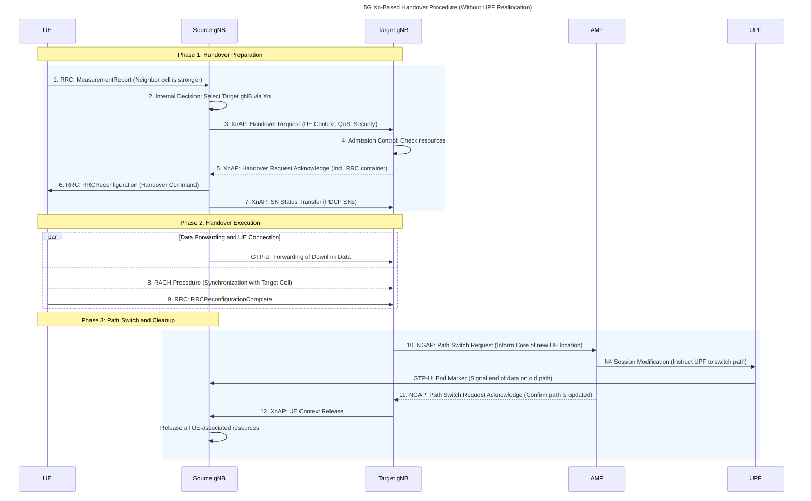

# Xn-based Handover Procedure

This document provides a comprehensive overview of the Xn-based handover procedure in 5G networks, focusing specifically on the scenario where the User Plane Function (UPF) is not reallocated.

#### **1. Introduction to 5G Handovers**

**What is a Handover?**
==A handover is a critical process in mobile networks that ensures a user's device (UE) maintains continuous connectivity as it moves between different network cells. It seamlessly transfers the data connection from one base station (gNB) to another without interrupting the user's service.==

*   **Key Purpose:** To provide seamless mobility and prevent service disruptions like dropped calls or buffering videos.
*   **Mechanism:** The network coordinates the transition by transferring the user's session context, Quality of Service (QoS) parameters, and any buffered data from the source gNB to the target gNB.

**Understanding the Xn Interface**
==The Xn interface is a direct communication link between two 5G base stations (gNBs).== Its primary purpose is to allow gNBs to communicate directly with each other without involving the core network. This is crucial for fast and efficient handovers.

*   **Xn vs. N2 Handovers:**
    *   **Xn Handover:** Direct gNB-to-gNB communication. It is faster and has lower latency.
    *   **N2 Handover:** Communication is routed through the core network (specifically the AMF). This is slower and used when a direct Xn link is unavailable.

---
#### **2. The Role of the User Plane Function (UPF)**

The UPF is a core component of the 5G network. It acts as the anchor point for a user's data session and is responsible for:
*   Packet routing and forwarding.
*   Enforcing Quality of Service (QoS) policies.
*   Connecting the mobile network to external data networks (like the internet).

**Why Avoid UPF Reallocation?**
In many handover scenarios, the UE's data path continues to be routed through the *same* UPF even after moving to a new gNB. This is known as a handover **without UPF reallocation**. The network, specifically the Session Management Function (SMF), decides to do this for several reasons:

1.  **Geographic Proximity:** If the source and target gNBs are close to each other, the existing UPF is likely still well-positioned to handle the data traffic efficiently.
2.  **Minimize Signaling Overhead:** Keeping the same UPF avoids the complex and time-consuming process of tearing down the data path to the old UPF and setting up a new one. This reduces the number of signaling messages required, making the network more efficient.
3.  **Service Continuity:** If the user's current services (e.g., streaming, browsing) can be adequately supported by the existing UPF, there is no need to change it.

---


---
#### **3. Step-by-Step Xn-based Handover Procedure (Without UPF Reallocation)**

##### **Phase 1: Preparation Phase**

**Step 1: Measurement Reporting**
*   **Action:** The UE informs the network about its radio conditions.
*   **Message:** `RRC: MeasurementReport`
*   **From -> To:** UE -> Source gNB
*   **Technical Detail:** Before this step, the source gNB sends an `RRCReconfiguration` message with a `measConfig` element. This configures the UE to perform measurements and defines the trigger, such as **Event A3** (neighbor becomes better than serving cell by an offset).
*   **Example Message Content:**
    ```
    MeasurementReport {
      measResults {
        servingCell { rsrp: -95dBm, rsrq: -12dB },
        neighbourCells {
          pci: 101, rsrp: -85dBm, rsrq: -9dB
          pci: 102, rsrp: -98dBm, rsrq: -14dB
        }
      }
    }
    ```
*   **Purpose (Why):** This report acts as the trigger, providing the source gNB with concrete data showing that a handover to the cell with Physical Cell ID (PCI) 101 would improve the user's connection quality.

**Step 2: Handover Decision**
*   **Action:** The source gNB decides to initiate the handover.
*   **Message:** (Internal gNB Process)
*   **Purpose (Why):** The gNB's algorithm confirms that the conditions reported by the UE are stable and warrant a handover. It selects the cell with PCI 101 as the target and verifies an active Xn connection to its gNB.

**Step 3: Handover Request**
*   **Action:** The source gNB asks the target gNB to prepare for the UE.
*   **Message:** `XnAP: Handover Request`
*   **From -> To:** Source gNB -> Target gNB
*   **Technical Detail:** This message contains the entire UE context needed for the target to prepare. This includes security keys, active data radio bearers (DRBs), QoS flows, and the UE's capabilities.
*   **Example Message Content:**
    ```
    HandoverRequest {
      targetCellID: 101,
      ueContextInformation {
        ueSecurityCapabilities,
        rrcContext,
        pduSessionResourcesToSetupList [ {pduSessionID, qosFlows} ]
      }
    }
    ```
*   **Purpose (Why):** This formal request provides all necessary information for the target gNB to perform admission control and allocate resources without needing to query the core network.

**Step 4 & 5: Admission Control and Acknowledgment**
*   **Action:** The target gNB reserves resources and confirms its readiness.
*   **Message:** `XnAP: Handover Request Acknowledge`
*   **From -> To:** Target gNB -> Source gNB
*   **Technical Detail:** The target gNB performs **Admission Control**. If successful, it prepares the radio resources and embeds the handover instructions for the UE inside a transparent container within the acknowledgment message.
*   **Example Message Content:**
    ```
    HandoverRequestAcknowledge {
      pduSessionResourcesAdmittedList,
      targetToSourceTransparentContainer { // Contains the RRC Handover Command
        handoverCommand { new-c-rnti: 55, ... }
      }
    }
    ```
*   **Purpose (Why):** This confirms to the source gNB that the handover can proceed and provides the exact RRC command that must be sent to the UE.

**Step 6: Handover Command to the UE**
*   **Action:** The source gNB commands the UE to switch cells.
*   **Message:** `RRC: RRCReconfiguration`
*   **Technical Detail:** This message includes the `mobilityControlInfo` Information Element (IE), which is the transparent container received from the target gNB.
*   **Example Message Content:**
    ```
    RRCReconfiguration {
      mobilityControlInfo {
        targetPhysCellId: 101,
        newUE-Identity: 55, // The new C-RNTI
        rach-ConfigDedicated { ... } // For faster, contention-free access
      }
    }
    ```
*   **Purpose (Why):** This is the official command for the UE to execute the handover. It provides all the parameters needed to connect to the new cell quickly.

**Step 7: Data Forwarding Preparation**
*   **Action:** The source gNB ensures a lossless data transition.
*   **Message:** `XnAP: SN Status Transfer`
*   **From -> To:** Source gNB -> Target gNB
*   **Technical Detail:** This message contains the Packet Data Convergence Protocol (PDCP) sequence numbers (SN) and Hyper Frame Numbers (HFN) for both uplink and downlink data bearers. This ensures data is not lost or duplicated. Simultaneously, the source gNB starts forwarding buffered downlink packets to the target gNB over the **Xn-U (User Plane)** interface.
*   **Purpose (Why):** To minimize data interruption. The target gNB can immediately start sending data to the UE in the correct sequence as soon as the UE connects.

---
##### **Phase 2: Execution Phase**

**Step 8 & 9: UE Connects and Confirms**
*   **Action:** The UE synchronizes with the target gNB and confirms handover success.
*   **Message:** `RRC: RRCReconfigurationComplete`
*   **From -> To:** UE -> Target gNB
*   **Technical Detail:** The UE uses the `rach-ConfigDedicated` parameters to perform a contention-free Random Access procedure, which is faster and more reliable than a contention-based one.
*   **Purpose (Why):** The successful reception of this message signals the end of the radio part of the handover. The target gNB now knows the UE is under its control and can start scheduling uplink data from the UE.

---
##### **Phase 3: Completion Phase**

**Step 10: Path Switch Request**
*   **Action:** The target gNB informs the core network of the change.
*   **Message:** `NGAP: Path Switch Request`
*   **From -> To:** Target gNB -> AMF
*   **Technical Detail:** The AMF is the control plane entry point to the 5G Core. This message is essential to update the core network's view of where the UE is located.
*   **Example Message Content:**
    ```
    PathSwitchRequest {
      ran-ue-ngap-id: 1234,
      source-amf-ue-ngap-id: 5678,
      userLocationInformationNR { TAI, NCGI: 101 }
    }
    ```
-  **Purpose (Why):** This request triggers the core network to redirect the downlink data path from the source gNB to the target gNB.

**Step 11: Path Switch Acknowledgment**
*   **Action:** The core network confirms the data path has been updated.
*   **Message:** `NGAP: Path Switch Request Acknowledge`
*   **From -> To:** AMF -> Target gNB
*   **Technical Detail:** Upon receiving the request, the AMF informs the SMF, which in turn sends an **N4 Session Modification Request** to the UPF to update the downlink forwarding tunnel. The UPF also sends an **"End Marker"** packet down the old path to the source gNB to signify that no more data will be sent that way.
*   **Purpose (Why):** This confirms to the target gNB that it is now the official anchor point for the UE's data path in the RAN and will receive all subsequent downlink traffic from the UPF.

**Step 12: Release of Resources**
*   **Action:** The source gNB is told to release all resources related to the UE.
*   **Message:** `XnAP: UE Context Release`
*   **From -> To:** Target gNB -> Source gNB
*   **Technical Detail:** This is a simple but vital command containing the UE's identifiers.
*   **Purpose (Why):** This is a final housekeeping step. The source gNB can now safely delete the UE's context and free up its radio and transport resources, making them available for other users and preventing resource leakage.

---
#### **4. Benefits and Implications**

This streamlined handover procedure offers significant advantages:

| Implication Category     | Benefit                                                                                                                                                                                                                                                                                                                      |
| :----------------------- | :--------------------------------------------------------------------------------------------------------------------------------------------------------------------------------------------------------------------------------------------------------------------------------------------------------------------------- |
| **Network Implications** | **Reduced Signaling Load:** Fewer messages are sent to the core network, reducing congestion. <br> **Simplified Management:** The process is less complex than one involving UPF reallocation. <br> **Efficient Resource Use:** Frees up resources on the source gNB promptly.                                               |
| **User Implications**    | **Reduced Latency:** Direct gNB-to-gNB communication is faster, resulting in handover times of ~30ms compared to ~100ms for procedures requiring UPF reallocation. <br> **Improved Quality of Experience:** Less service interruption, ensuring a smooth experience for applications like video streaming and online gaming. |
