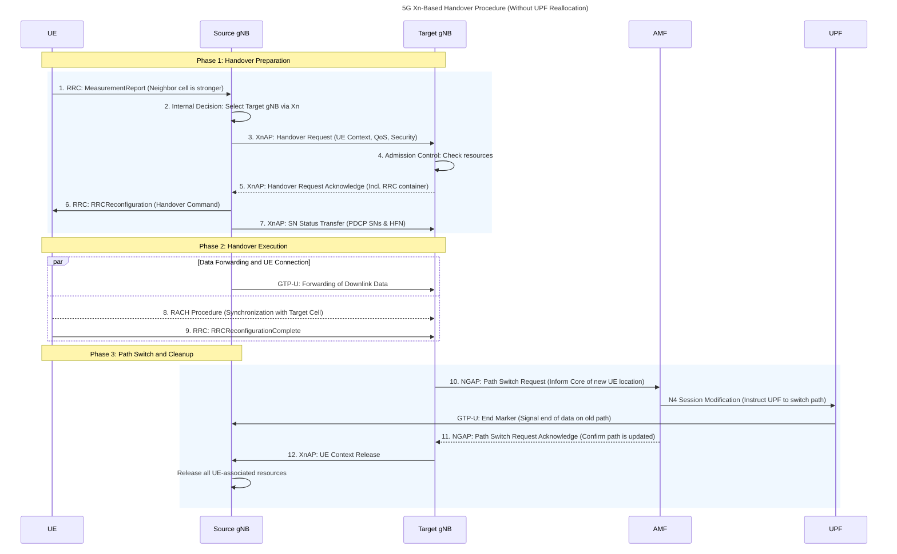

***

### **5G Xn-based Inter-NG-RAN Handover **

This document provides a comprehensive overview of the Xn-based handover procedure in 5G networks, focusing specifically on the scenario where the User Plane Function (UPF) is not reallocated.

#### **1. Core Concepts & Key Points**

##### ==**What is a Handover?**==
==A handover is a critical process in mobile networks that ensures a user's device (UE) maintains continuous connectivity as it moves between different network cells. It seamlessly transfers the data connection from one base station (gNB) to another without interrupting the user's service.==

##### **Understanding the Xn Interface**
The Xn interface is a direct communication link between two 5G base stations (gNBs). It has two parts:
*   **Xn-C (Control Plane):** Manages signaling between gNBs using the **XnAP** protocol.
*   **Xn-U (User Plane):** Manages the forwarding of user data between gNBs using the **GTP-U** protocol.

This direct link is crucial for fast and efficient handovers, as it minimizes core network involvement.

##### **Key Technical Points for Xn Handover**
*   **Analogy:** The Xn handover is the 5G equivalent of the X2 handover in 4G LTE.
*   **Prerequisite:** ==A stable Xn interface must be established between the source and target gNBs.==
*   **AMF Constraint:** ==The procedure is only applicable for **intra-AMF** mobility.== If the gNBs are connected to different AMFs, a more complex N2 (or NGAP-based) handover is required.
*   **Frequency Types:** Xn handovers can be either **Intra-Frequency** (same frequency band) or **Inter-Frequency** (different frequency bands).
*   **Registration Update:** If the handover results in the UE moving to a new Tracking Area (TA), the UE must perform a Registration procedure after the handover is complete to update its location with the AMF.

##### **Xn Handover Procedure**

![[Pasted image 20250729112312.png]]

Above picture depicts the mobility scenarios where UEs is connected to 
- **source cell** with PCI: 22 with **gNB#1** and it is moving toward 
- target cell#2 with PCI:21 with **gNB#2**. 

In this handover procedure the signaling will involve messaging over Xn interface using **XnAP protocol** and over N2 interface using **NGAP protocol**. Considering **Control and User Plane split** architecture of gNB-CUCP#1 connects with gNB-CUCP#2 over Xn interface for Control Plane signalling using **XnAP protocol**, where as the User plane between two gNB is managed by respective CUUP functions using **GTP-U protocol**.

---
#### **2. The Role of the User Plane Function (UPF)**

The UPF is a core component of the 5G network. It acts as the anchor point for a user's data session and is responsible for packet routing, QoS enforcement, and connecting to external data networks.

**Why Avoid UPF Reallocation?**
In this scenario, the UE's data path continues through the *same* UPF. The network's Session Management Function (SMF) chooses this for several reasons:
1.  **Geographic Proximity:** If gNBs are close, the existing UPF is still optimal for the data path.
2.  **Minimize Signaling Overhead:** Keeping the same UPF avoids the complex signaling needed to establish a new data path in the core network, making the handover faster and more efficient.
3.  **Service Continuity:** If the user's current services can be supported by the existing UPF, there is no need to change it.

---


```mermaid
sequenceDiagram
    participant UE
    participant Source gNB
    participant Target gNB
    participant AMF
    participant UPF

    title 5G Xn-Based Handover Procedure (Without UPF Reallocation)

    %% Phase 1: Preparation
    Note over UE, Target gNB: Phase 1: Handover Preparation
    
    rect rgb(240, 248, 255)
        %% Step 1: Measurement Reporting
        UE->>Source gNB: 1. RRC: MeasurementReport (Neighbor cell is stronger)
        
        %% Step 2: Handover Decision
        Source gNB->>Source gNB: 2. Internal Decision: Select Target gNB via Xn
        
        %% Step 3: Handover Request
        Source gNB->>Target gNB: 3. XnAP: Handover Request (UE Context, QoS, Security)
        
        %% Step 4 & 5: Admission Control and Acknowledgment
        Target gNB->>Target gNB: 4. Admission Control: Check resources
        Target gNB-->>Source gNB: 5. XnAP: Handover Request Acknowledge (Incl. RRC container)
        
        %% Step 6: Handover Command
        Source gNB->>UE: 6. RRC: RRCReconfiguration (Handover Command)
        
        %% Step 7: Data Forwarding Preparation
        Source gNB->>Target gNB: 7. XnAP: SN Status Transfer (PDCP SNs & HFN)
    end
    
    %% Phase 2: Execution
    Note over UE, Target gNB: Phase 2: Handover Execution
    
    par Data Forwarding and UE Connection
        Source gNB->>Target gNB: GTP-U: Forwarding of Downlink Data
    and
        %% Step 8: UE Access to Target Cell
        UE-->>Target gNB: 8. RACH Procedure (Synchronization with Target Cell)
        
        %% Step 9: Handover Confirmation
        UE->>Target gNB: 9. RRC: RRCReconfigurationComplete
    end

    %% Phase 3: Completion
    Note over UE, Source gNB: Phase 3: Path Switch and Cleanup

    rect rgb(240, 248, 255)
        %% Step 10: Path Switch Request
        Target gNB->>AMF: 10. NGAP: Path Switch Request (Inform Core of new UE location)
        
        %% Core Network Path Update
        AMF->>UPF: N4 Session Modification (Instruct UPF to switch path)
        UPF->>Source gNB: GTP-U: End Marker (Signal end of data on old path)
        
        %% Step 11: Path Switch Acknowledge
        AMF-->>Target gNB: 11. NGAP: Path Switch Request Acknowledge (Confirm path is updated)
        
        %% Step 12: Release Resources
        Target gNB->>Source gNB: 12. XnAP: UE Context Release
        Source gNB->>Source gNB: Release all UE-associated resources
    end
```

---
#### **3. Step-by-Step Xn-based Handover Procedure (Detailed)**

##### **Phase 1: Preparation Phase**

###### **Step 1: Measurement Reporting**
*   **Action:** The UE is in `RRC_CONNECTED` state and informs the network about its radio conditions.
*   **Message:** `RRC: MeasurementReport`
*   **From -> To:** UE -> Source gNB
*   **Technical Detail:** The source gNB pre-configures the UE with a `measConfig` element (via an earlier `RRCReconfiguration`), defining what to measure and when to report. A common trigger is **Event A3**, where a neighbor cell's signal becomes stronger than the serving cell's by a specific offset.
*   **Example Message Content:** 
```
MeasurementReport {
  measResults {
    servingCell { rsrp: -95dBm, rsrq: -12dB },
    neighbourCells {
      pci: 101, rsrp: -85dBm, rsrq: -9dB
      pci: 102, rsrp: -98dBm, rsrq: -14dB
    }
  }
}
```
*   **Purpose:** This report provides the source gNB with data to make an informed handover decision.

###### **Step 2: Handover Decision**
*   **Action:** The source gNB decides to initiate the handover based on the report.
*   **Purpose:** The gNB's algorithm verifies that a handover to the cell with Physical Cell ID (PCI) 101 is necessary and that an Xn link to its controlling gNB is available.

###### **Step 3: Handover Request**
*   **Action:** The source gNB asks the target gNB to prepare for the UE.
*   **Message:** `XnAP: Handover Request`
*   **From -> To:** Source gNB -> Target gNB
*   **Example Message Content:** 
```
HandoverRequest {
  targetCellID: 101,
  ueContextInformation {
    ueSecurityCapabilities,
    rrcContext,
    pduSessionResourcesToSetupList [ {pduSessionID, qosFlows} ]
  }
}
```
*   **Purpose:** To formally request the handover and provide the target gNB with the complete UE context (security, QoS flows, data bearers) so it can prepare resources without querying the core network.

###### **Step 4 & 5: Admission Control and Acknowledgment**
*   **Action:** The target gNB reserves resources and confirms its readiness.
*   **Message:** `XnAP: Handover Request Acknowledge`
*   **From -> To:** Target gNB -> Source gNB
*   **Technical Detail:** The target performs **Admission Control**. If successful, it prepares radio resources and embeds the handover instructions for the UE inside a `targetToSourceTransparentContainer`.
*   **Example Message Content:** 
```
HandoverRequestAcknowledge {
  pduSessionResourcesAdmittedList,
  targetToSourceTransparentContainer { // Contains the RRC Handover Command
    handoverCommand { new-c-rnti: 55, ... }
  }
}
```
*   **Purpose:** To confirm the handover can proceed and to provide the source gNB with the exact RRC command (in the container) to send to the UE.

###### **Step 6: Handover Command to the UE**
*   **Action:** The source gNB commands the UE to switch cells.
*   **Message:** `RRC: RRCReconfiguration`
*   **From -> To:** Source gNB -> UE
*   **Technical Detail:** The source gNB triggers the handover by sending the **RRCReconfiguration** message to the UE, containing the information required to access the **target cell**. This message includes the `mobilityControlInfo` IE, which contains the new C-RNTI, target cell security algorithms, and optionally, dedicated RACH preambles for a faster, contention-free access.
*   **Example Message Content:** 
```
RRCReconfiguration {
  mobilityControlInfo {
    targetPhysCellId: 101,
    newUE-Identity: 55, // The new C-RNTI
    rach-ConfigDedicated { ... } // For faster, contention-free access
  }
}
```
*   **Purpose:** This is the official command for the UE to execute the handover.

###### **Step 7: Data Forwarding Preparation**
*   **Action:** The source gNB ensures a lossless data transition.
*   **Message:** `XnAP: SN Status Transfer`
*   **From -> To:** Source gNB -> Target gNB
*   **Technical Detail:** This message contains the Packet Data Convergence Protocol (PDCP) Sequence Numbers (SN) and Hyper Frame Numbers (HFN) for both UL and DL bearers. The source gNB also begins buffering and forwarding in-flight downlink packets to the target gNB over the **Xn-U (User Plane)** interface.
*   **Purpose:** To minimize data loss and ensure the target gNB can resume data transmission in the correct sequence.
* ![[Pasted image 20250729113203.png]]

---

##### **Phase 2: Execution Phase**

###### **Step 8 & 9: UE Connects and Confirms**
*   **Action:** The UE synchronizes with the target gNB and confirms handover success.
*   **Message:** `RRC: RRCReconfigurationComplete`
*   **From -> To:** UE -> Target gNB
*   **Technical Detail:** The UE uses the `rach-ConfigDedicated` parameters for a fast, contention-free Random Access procedure. Once synchronized, it sends the confirmation message.
*   **Purpose:** This message confirms the UE is successfully under the target gNB's control. The target gNB can now schedule uplink data, and the UE can start transmitting. This completes the radio-level portion of the handover.

---

##### **Phase 3: Completion Phase**

###### **Step 10: Path Switch Request**
*   **Action:** The target gNB informs the core network of the change.
*   **Message:** `NGAP: Path Switch Request`
*   **From -> To:** Target gNB -> AMF
*   **Example Message Content:** 
```
PathSwitchRequest {
  ran-ue-ngap-id: 1234,
  source-amf-ue-ngap-id: 5678,
  userLocationInformationNR { TAI, NCGI: 101 }
}
```
*   **Purpose:** To trigger the core network to update the UE's location and switch the downlink data path from the source gNB to the target gNB.

###### **Step 11: Path Switch Acknowledgment**
*   **Action:** The core network confirms the data path has been updated.
*   **Message:** `NGAP: Path Switch Request Acknowledge`
*   **From -> To:** AMF -> Target gNB
*   **Technical Detail:** The AMF instructs the SMF, which sends an **N4 Session Modification Request** to the UPF to update the forwarding tunnel. The UPF then sends an **"End Marker"** packet down the old path to the source gNB. This special packet signals that no more user data will be sent via that route.
*   **Purpose:** This confirms to the target gNB that it is now the official anchor for the UE's data path and will receive all subsequent downlink traffic.

###### **Step 12: Release of Resources**
*   **Action:** The source gNB is told to release all resources related to the UE.
*   **Message:** `XnAP: UE Context Release`
*   **From -> To:** Target gNB -> Source gNB
*   **Purpose:** This is a final housekeeping step. The source gNB can now safely delete the UE's context and free up its radio and transport resources, preventing resource leakage.

---
#### **4. Benefits and Implications**

| Implication Category     | Benefit                                                                                                                                                                                                                                                                                                                      |
| :----------------------- | :--------------------------------------------------------------------------------------------------------------------------------------------------------------------------------------------------------------------------------------------------------------------------------------------------------------------------- |
| **Network Implications** | **Reduced Signaling Load:** Fewer messages are sent to the core network, reducing congestion. <br> **Simplified Management:** The process is less complex than one involving UPF reallocation. <br> **Efficient Resource Use:** Frees up resources on the source gNB promptly.                                               |
| **User Implications**    | **Reduced Latency:** Direct gNB-to-gNB communication is faster, resulting in handover times of ~30ms compared to ~100ms for procedures requiring UPF reallocation. <br> **Improved Quality of Experience:** Less service interruption, ensuring a smooth experience for applications like video streaming and online gaming. |

---

#### **Links**
- [5G SA Inter gNB Handover - Xn Handover - 5G Call Flow](https://www.techplayon.com/5g-sa-inter-gnb-hanodver-xn-handover/)
- [5G Handover](https://devopedia.org/5g-handover)
- 